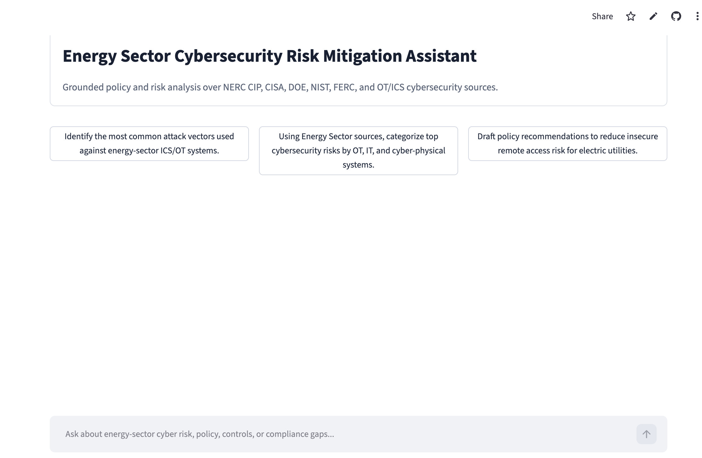
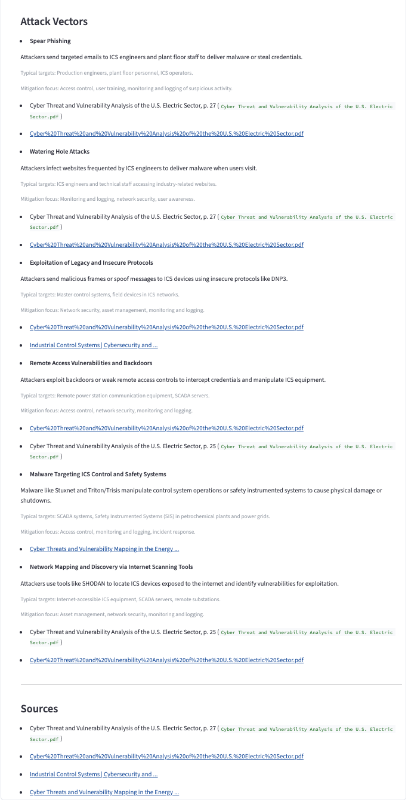

# Cybersecurity RAG Assistant

This project is a local question-answering application for critical
infrastructure sector cybersecurity research. It helps users ask
plain-English questions and receive answers grounded in a document
collection.

The application is built with Python, Streamlit, OpenAI, and Pinecone:

-   Python runs the application.
-   Streamlit provides the browser-based chat screen.
-   OpenAI turns questions and documents into searchable meaning and
    writes the final answer.
-   Pinecone stores searchable document chunks.

## Who This Is For

This project is for:

-   Critical sector cybersecurity analysts.
-   Policy researchers.
-   Developers maintaining a retrieval-augmented generation system.

It is not a general chatbot. It is designed for grounded analysis over
critical infrastructure cybersecurity documents.

## What It Can Do

-   Answer questions using retrieved evidence.
-   Retrieve evidence from document-derived text chunks.
-   Cite source documents used for an answer.
-   Group findings by cybersecurity control family.
-   Draft policy recommendations and action plans.
-   Refresh the knowledge base with selected web sources.
-   Run through a browser interface or command-line script.
-   Decline to answer when sufficient supporting evidence is
    unavailable.

## Screenshots





# Quick Start

These instructions assume you have already cloned the repository and are
working in:

``` text
~/github/Applied_AI_Base
```

The goal of the Quick Start is to verify that the baseline pipeline runs
successfully. You do **not** need to build or modify the source corpus
to complete this initial verification.

## 1. Check Python

The project requires Python 3.10 or newer.

On Ubuntu in Windows Subsystem for Linux (WSL), check your version with:

``` bash
python3 --version
```

Expected output:

``` text
Python 3.x.x
```

### WSL prerequisite: Python virtual environments

Some Ubuntu/WSL installations include Python but do not include the
package required to create Python virtual environments.

If the virtual-environment command in the next step reports that
`ensurepip` is not available, install the appropriate `venv` package for
your installed Python version. For example, with Python 3.12:

``` bash
sudo apt install python3.12-venv
```

`sudo` may ask for your **WSL Ubuntu password**. This is the password
for your Linux user account inside WSL and may be different from your
Windows or UMW password.

## 2. Create a Virtual Environment

On WSL/Linux:

``` bash
python3 -m venv venv
```

Expected output: usually no text appears. That is normal.

If a failed attempt left an incomplete `venv/` directory:

``` bash
rm -rf venv
python3 -m venv venv
```

## 3. Turn On the Virtual Environment

``` bash
source venv/bin/activate
```

Your terminal prompt should now begin with `(venv)`.

Verify Python inside the environment:

``` bash
python --version
```

## 4. Install the Project Libraries

``` bash
pip install -r requirements.txt
```

Expected output: many lines ending with a success message.

If `pip` is not available inside the activated virtual environment:

``` bash
python -m pip install -r requirements.txt
```

## 5. Create Your `.env` File

Create a file named `.env` in the project root:

``` text
OPENAI_API_KEY=your_openai_api_key_here
PINECONE_API_KEY=your_pinecone_api_key_here
PINECONE_INDEX=applied-ai-base
PINECONE_CLOUD=aws
PINECONE_REGION=us-east-1
OPENAI_EMBED_MODEL=text-embedding-3-small
OPENAI_MODEL=gpt-4.1-mini
```

Your instructor will provide the course OpenAI and Pinecone credentials.

Do **not** share your `.env` file or commit it to GitHub. It contains
secret keys.

The Pinecone environment is shared by the class. Coordinate with other
students before resetting or rebuilding the shared Pinecone index.

> **Note:** The baseline model configuration may be revised by the class
> as part of CPSC 491. Do not independently change the foundation model
> unless the class has agreed to do so.

## 6. Start the Browser App

With `(venv)` visible in your terminal prompt:

``` bash
streamlit run streamlit_app.py
```

The first time Streamlit runs, it may ask whether you want to provide an
email address. You may leave the field blank and press Enter.

Expected output includes:

``` text
Local URL: http://localhost:8501
```

Open that address in your Windows browser.

Under WSL, you may see:

``` text
gio: http://localhost:8501: Operation not supported
```

This does **not** mean the application failed. WSL simply could not open
the browser automatically. Open `http://localhost:8501` manually.

## 7. Verify the Baseline Pipeline

When the Streamlit landing page appears, submit a question.

If the shared Pinecone index does not contain relevant source material,
the application may report that it cannot find enough local evidence to
answer confidently and may return no sources.

That is **correct behavior**. The RAG pipeline is designed not to invent
an answer when adequate supporting evidence is unavailable.

For the initial setup, success means:

-   the repository is available locally;
-   the Python virtual environment starts;
-   the project libraries install;
-   Streamlit launches;
-   the browser interface appears;
-   the application accepts a question; and
-   the pipeline responds appropriately, including declining to answer
    when evidence is unavailable.

At this point, the baseline application is running successfully. Further
corpus construction, indexing, evaluation, and pipeline modification
will be performed as part of the course research work.

# Requirements

  -----------------------------------------------------------------------
  Requirement             Needed?                 Notes
  ----------------------- ----------------------- -----------------------
  Python 3.10 or newer    Yes                     Python runs the app and
                                                  scripts.

  Python `venv` support   Yes                     Required to create the
                                                  local virtual
                                                  environment.

  OpenAI API key          Yes                     Used for embeddings and
                                                  final answers.

  Pinecone API access     Yes for full retrieval  The class uses a shared
                                                  Pinecone environment.

  SerpAPI key             Optional                Used for live web
                                                  discovery and refresh.

  Internet access         Yes                     Needed to install
                                                  packages and call
                                                  external services.

  Docker                  No                      This repo does not
                                                  include Docker files.

  Traditional database    No                      The current RAG flow
                                                  uses JSONL files and
                                                  Pinecone.
  -----------------------------------------------------------------------

# Environment Variables

  ------------------------------------------------------------------------------------------------------------------------------------------------------
  Name                       Required?      Default                                                         Description    Example
  -------------------------- -------------- --------------------------------------------------------------- -------------- -----------------------------
  `OPENAI_API_KEY`           Yes            None                                                            Secret key for `sk-...`
                                                                                                            OpenAI.        

  `PINECONE_API_KEY`         Yes for        None                                                            Secret key for `pcsk_...`
                             Pinecone                                                                       Pinecone.      
                             search                                                                                        

  `PINECONE_INDEX`           Yes for        `reviews-index` in indexing script                              Shared         `applied-ai-base`
                             Pinecone                                                                       Pinecone index 
                             search                                                                         name.          

  `PINECONE_CLOUD`           Needed when    `aws`                                                           Pinecone cloud `aws`
                             creating an                                                                    provider.      
                             index                                                                                         

  `PINECONE_REGION`          Needed when    `us-east-1`                                                     Pinecone       `us-east-1`
                             creating an                                                                    region.        
                             index                                                                                         

  `PINECONE_NAMESPACE`       No             Empty string                                                    Optional       `research-test`
                                                                                                            Pinecone       
                                                                                                            namespace.     

  `OPENAI_EMBED_MODEL`       No             `text-embedding-3-small`                                        OpenAI         `text-embedding-3-small`
                                                                                                            embedding      
                                                                                                            model.         

  `OPENAI_MODEL`             No             `gpt-4.1-mini`                                                  OpenAI answer  `gpt-4.1-mini`
                                                                                                            model in the   
                                                                                                            current        
                                                                                                            baseline.      

  `SERPAPI_API_KEY`          Optional       None                                                            Secret key for `abc123`
                                                                                                            SerpAPI.       

  `SERPAPI_KEY`              Optional       None                                                            Alternate      `abc123`
                                                                                                            SerpAPI        
                                                                                                            variable name. 

  `ENABLE_SERPAPI_SEARCH`    Optional       `true`                                                          Enables        `false`
                                                                                                            automatic live 
                                                                                                            search.        

  `SERPAPI_MAX_RESULTS`      Optional       `3`                                                             Number of live `3`
                                                                                                            search         
                                                                                                            results.       

  `SERPAPI_QUERY_TEMPLATE`   Optional       `{query} critical infrastructure cybersecurity energy sector`   Live-search    `{query} NERC CIP advisory`
                                                                                                            query pattern. 

  `PINECONE_ID_STRATEGY`     Optional       `url`                                                           Strategy for   `url`
                                                                                                            live web chunk 
                                                                                                            IDs.           
  ------------------------------------------------------------------------------------------------------------------------------------------------------

# Running the Project

## Development

``` bash
streamlit run streamlit_app.py
```

## Command-Line Query

``` bash
python -m scripts.04_query_bot --q "What are NERC CIP access control requirements?"
```

With debug information:

``` bash
python -m scripts.04_query_bot --q "How should incident response be handled in OT systems?" --debug
```

## Testing and Evaluation

``` bash
python -m scripts.05_eval_grounding
```

This runs sample questions and writes results to
`data/eval_results.jsonl`.

# Corpus and Pinecone Maintenance

These tasks are **not required merely to verify that the baseline
application runs**. Use them when the class deliberately creates,
changes, or re-indexes the research corpus.

## Build the Local Corpus

Populate `data/pdf/` with approved source documents, then run:

``` bash
python -m scripts.02_prepare_energy_json
```

This reads PDFs and writes `data/critical_infra_corpus.jsonl`.

The repository may intentionally contain no source PDFs at the beginning
of a research cycle. Source selection and corpus construction may be
part of the course research work.

## Upload the Corpus to Pinecone

``` bash
python -m scripts.03_index_pinecone --chunks data/critical_infra_corpus.jsonl --reset
```

**Warning:** `--reset` deletes the existing contents of the selected
Pinecone index before uploading the current corpus. Because the class
uses a shared Pinecone environment, coordinate with the other students
before running this command.

## Add Web Sources to Pinecone

``` bash
python -m scripts.06_ingest_web_sources --url https://example.gov/example-page
```

Preview without writing:

``` bash
python -m scripts.06_ingest_web_sources --dry-run
```

# Repository Structure

``` text
.
├── app/
├── data/
├── docs/
├── scripts/
├── config.py
├── control_families.py
├── requirements.txt
├── streamlit_app.py
└── README.md
```

  ------------------------------------------------------------------------
  Path                                 Purpose
  ------------------------------------ -----------------------------------
  `app/`                               Core application code for retrieval
                                       and answer generation.

  `app/rag.py`                         Main retrieval-augmented generation
                                       pipeline.

  `app/control_families.py`            Control-family keyword detection.

  `control_families.py`                Duplicate top-level control-family
                                       helper used by scripts.

  `data/`                              Local corpus and source files.

  `data/pdf/`                          PDF documents used to build the
                                       corpus when present.

  `data/critical_infra_corpus.jsonl`   Extracted text chunks used for
                                       retrieval when generated.

  `scripts/`                           Command-line maintenance and
                                       workflow scripts.

  `streamlit_app.py`                   Browser-based user interface.

  `config.py`                          Environment loading helpers.

  `requirements.txt`                   Python libraries needed by the
                                       project.

  `docs/`                              Full end-user and maintainer
                                       documentation.
  ------------------------------------------------------------------------

# Common Tasks

## Restart the App

Stop Streamlit with `Control+C`, then run:

``` bash
streamlit run streamlit_app.py
```

## Rebuild the Corpus

``` bash
python -m scripts.02_prepare_energy_json
```

## Re-upload the Corpus to Pinecone

``` bash
python -m scripts.03_index_pinecone --chunks data/critical_infra_corpus.jsonl --reset
```

Coordinate with the class before using `--reset`.

# Troubleshooting

## `python: command not found` before the virtual environment is active

On Ubuntu/WSL, use:

``` bash
python3 --version
python3 -m venv venv
```

After the virtual environment is activated, `python` should be
available.

## Virtual environment fails because `ensurepip` is unavailable

Install the `venv` package matching your Python version. For Python
3.12:

``` bash
sudo apt install python3.12-venv
```

Then recreate the virtual environment.

## `Missing env var: OPENAI_API_KEY`

Add `OPENAI_API_KEY` to `.env`.

## `Missing OPENAI_API_KEY or PINECONE_API_KEY`

Add both values to `.env`.

## `No module named app`

Use module execution:

``` bash
python -m scripts.04_query_bot --q "test question"
```

Avoid:

``` bash
python scripts/04_query_bot.py
```

## Streamlit starts but the browser does not open automatically

If WSL reports:

``` text
gio: http://localhost:8501: Operation not supported
```

open `http://localhost:8501` manually in Windows.

## The bot says it cannot find enough evidence

This may be the correct result. Possible causes include an empty shared
Pinecone index, a corpus that does not address the question, or an
incorrect `PINECONE_INDEX` value.

The application is designed to avoid unsupported answers when sufficient
evidence is unavailable.

# FAQ

## What is RAG?

RAG means retrieval-augmented generation. The application first searches
available evidence, then asks an AI model to answer using that evidence.

## Where is my data stored?

Source documents used for a research corpus are placed in `data/pdf/`.
Extracted text is written to `data/critical_infra_corpus.jsonl`. Search
vectors are stored in Pinecone.

## Does this app have user accounts?

No.

## Does this app have an API?

No HTTP API endpoints were found. The app is used through Streamlit or
command-line scripts.

## Is there a database?

There is no traditional database in the current RAG flow. The project
uses local files and Pinecone.

## Can I use it without Pinecone?

Partly. The code can fall back to local keyword retrieval if Pinecone
access fails, but Pinecone is required for the intended vector-search
workflow.

# More Documentation

Start with [docs/README.md](docs/README.md).

Recommended reading order:

1.  [Getting Started](docs/getting-started.md)
2.  [Configuration](docs/configuration.md)
3.  [First Run](docs/first-run.md)
4.  [Daily Usage](docs/daily-usage.md)
5.  [Troubleshooting](docs/troubleshooting.md)
6.  [Developer Guide](docs/developer-guide.md)
