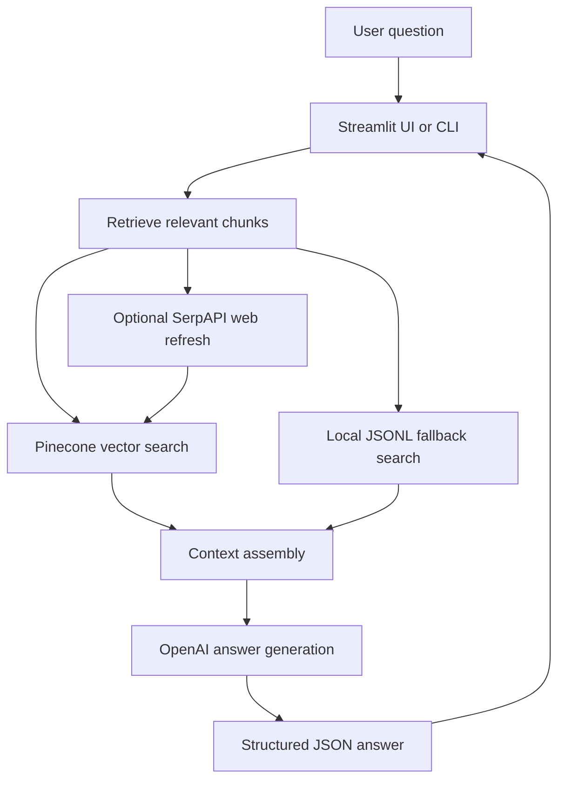
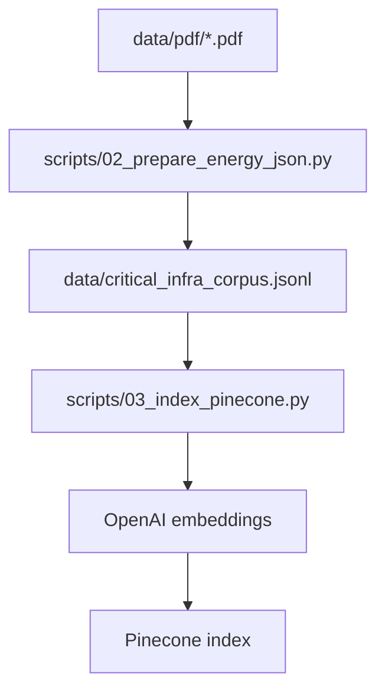

# Architecture

This page explains how the system works for future maintainers.

## High-Level Flow

## Main Runtime Path

1. `streamlit_app.py` receives the user's question.
2. It calls `generate_grounded_response()` in `app/rag.py`.
3. `app/rag.py` retrieves matching context from Pinecone.
4. If Pinecone retrieval fails, it uses local JSONL keyword retrieval.
5. If enabled, it uses SerpAPI to find web results and can save external chunks to Pinecone.
6. It builds a prompt with context and control-family signals.
7. It calls OpenAI.
8. It parses the model response as JSON.
9. It sanitizes sources so cited chunk IDs match retrieved context.
10. Streamlit renders the answer.

## Corpus Build Flow

## Major Modules

| Module | Role |
| --- | --- |
| `streamlit_app.py` | User interface, chat state, rendering sources and structured sections. |
| `app/rag.py` | Retrieval, web refresh, prompt building, OpenAI calls, output cleanup. |
| `app/control_families.py` | Keyword-based control detection. |
| `control_families.py` | Top-level duplicate used by scripts and `app/rag.py` imports. |
| `config.py` | Loads `.env` and exposes helper functions. |
| `scripts/02_prepare_energy_json.py` | Converts PDFs into JSONL chunks. |
| `scripts/03_index_pinecone.py` | Embeds chunks and upserts vectors to Pinecone. |
| `scripts/04_query_bot.py` | CLI query tool. |
| `scripts/05_eval_grounding.py` | Sample response evaluation. |
| `scripts/06_ingest_web_sources.py` | Web source discovery, scraping, dedupe, and ingestion. |

## Configuration Loading

`app/rag.py` and `config.py` look for:

1. `.env` in the current working directory.
2. `.env.local` in the current working directory.
3. `.env` in the project root.
4. `.env.local` in the project root.

`scripts/03_index_pinecone.py` and `scripts/06_ingest_web_sources.py` call `load_dotenv()` directly.

## Retrieval Behavior

Primary path:

- Embed the query with `OPENAI_EMBED_MODEL`.
- Query Pinecone using `PINECONE_INDEX` and optional `PINECONE_NAMESPACE`.
- Filter by organization when the query mentions NERC, NIST, CISA, FERC, or DOE.
- Exclude `is_owner_response` metadata when requested.

Fallback path:

- Read `data/critical_infra_corpus.jsonl`.
- Score chunks by token overlap.
- Boost chunks whose organization matches the query.

## OpenAI Generation

The project first tries the OpenAI Responses API with JSON output. If that fails, it tries Chat Completions with JSON output. If generation fails, it creates a local synthesized response from the retrieved contexts.

## External Integrations

| Service | Purpose |
| --- | --- |
| OpenAI | Embeddings and answer generation. |
| Pinecone | Vector storage and search. |
| SerpAPI | Optional Google search result discovery. |

## Background Jobs

No always-running background worker was found.

The scripts are manual jobs:

- Corpus build.
- Pinecone indexing.
- Web ingestion.
- Evaluation.

## Build Pipeline

TODO: Information could not be determined automatically.

No CI, build script, packaging setup, or deployment pipeline was found.
